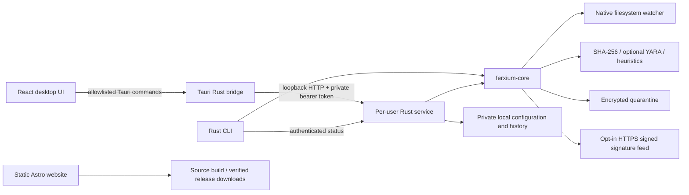

# FerXium

**Unbreakable Protection. Zero Cost. Built in Rust.**

FerXium combines **ferrum**, Latin for iron, with the **Xium** styling of NeXium: a Rust-inspired identity for free, open-source protection.

A free, MIT-licensed, local-first antivirus project for Windows, Linux, and macOS. No telemetry, accounts, paid tiers, upgrade prompts, or sample uploads. Rust powers the engine and service; Tauri 2 and React power the desktop; Astro powers the static website.

**Release status: 0.1.0 source preview.** This repository implements working scanning, filesystem monitoring, encrypted quarantine, local IPC, and a complete UI. The bundled signatures are test examples, not a production malware corpus. It has not been independently audited or certified. Keep existing endpoint protection while evaluating. The tagline expresses ambition; no antivirus guarantees unbreakable protection.

## Monorepo

```text
.
├── crates/
│   ├── ferxium-core/src/       # scanner, realtime, quarantine, updater, storage, YARA
│   ├── ferxium-core/tests/     # containment, integrity, signatures, exclusions
│   ├── ferxium-service/src/    # authenticated API, scan jobs, background monitoring
│   └── ferxium-cli/src/        # headless scanning and service status
├── apps/
│   ├── desktop/src/         # React + TypeScript + Tailwind, dark/light themes
│   ├── desktop/src-tauri/   # restricted Rust bridge and tray actions
│   └── website/src/         # Astro home, features, downloads, docs, about, blog
├── signatures/              # bundled hashes and illustrative YARA rules
├── packaging/               # per-user startup templates
├── scripts/                 # signed-feed tooling
├── docs/                    # architecture, security, build, release, roadmap
└── .github/workflows/       # platform builds, checks, and security tests
```

## Architecture



The service binds only to `127.0.0.1` on an ephemeral port. A fresh 256-bit token and discovery record live in private per-user storage. Browser origins are rejected. Tokens stay in the desktop Rust process. The desktop does not spawn an elevated service. See [the security model](docs/SECURITY_MODEL.md) before extending privileges or IPC.

## Run locally

Install stable Rust (1.90 or newer), Node.js 22.12 or newer, and your platform's [native prerequisites](docs/BUILDING.md).

```sh
npm ci
cargo build -p ferxium-service -p ferxium-cli
cargo run -p ferxium-service
```

In a second terminal:

```sh
npm run tauri -- dev
```

The service watches existing `Downloads` and `Desktop` folders by default. Configure additional absolute paths in Settings. Closing the desktop leaves the separately running service alone. Stop a foreground service with Ctrl+C.

For browser previews (explicitly labeled illustrative demos):

```sh
npm run dev:desktop  # http://localhost:1420; no file access in browser mode
npm run dev:website  # http://localhost:4321
```

For a headless scan:

```sh
cargo run -p ferxium-cli -- scan /absolute/path/to/folder
cargo run -p ferxium-cli -- status
```

CLI results are newline-delimited JSON. Exit codes: `0` no detections, `1` detections, `2` traversal/read errors. A result describes only checked files under the current rules.

Enable native YARA explicitly:

```sh
cargo run -p ferxium-service --features yara-engine
cargo test -p ferxium-core --features yara-engine
```

The service exposes `yara_enabled`; the dashboard accurately shows when it is absent. YARA builds need a C toolchain. Hash and heuristic scanning work without native YARA.

## Implemented behavior

| Area               | Current implementation                                                                                                                                    |
| ------------------ | --------------------------------------------------------------------------------------------------------------------------------------------------------- |
| File monitoring    | Native `notify` watchers, bounded event queue, debounce, visible drops; observes changes after they happen                                                |
| Process monitoring | Poll PID and start time every 5 seconds; scan newly observed executable files                                                                             |
| Network awareness  | Local interface byte counters and a sampled TCP connection count; no traffic inspection or blocking                                                       |
| Scans              | Quick executable/startup/browser-extension checks; full accessible-volume scans; custom roots; streaming enumeration, pause/resume/cancel, estimated time |
| Detection          | SHA-256 feed; EICAR recognition; optional YARA; conservative script-pattern review signals                                                                |
| Threat actions     | Review, encrypted quarantine, non-overwriting restore, delete quarantine backup, allow exact hash                                                         |
| Scheduling         | Interval quick scans and signature updates while the service is running                                                                                   |
| Updates            | Explicitly configured HTTPS feed, pinned Ed25519 key, exact payload authentication, monotonic versions                                                    |
| Privacy            | No telemetry, sample uploads, or configured cloud provider; local reports and state                                                                       |
| UI                 | Five sections, live status, reports, activity, native folder/save dialogs, tray quick actions, themes                                                     |
| Website            | Six responsive static pages, accessible navigation/FAQ, local fonts, SEO, truthful release placeholders                                                   |

Memory scanning, pre-execution blocking, archive inspection, robust missed-event recovery, tamper resistance, and privileged system protection are not implemented. Full scans skip special files, symlinks, excluded locations, application state, Linux pseudo filesystems, and files above the configured limit. Read errors are counted. Quick scanning covers common locations, not every browser profile or startup mechanism. See [the roadmap](docs/ROADMAP.md).

## Quarantine and recovery

Actions require an explicit user decision. Quarantine authenticates an encrypted backup, stages the source in a private directory on its own volume, rehashes the moved object, then removes that staged source. Changed files are retained rather than deleted. Incomplete operations expose `source_removed: false` and `staging_path` for recovery. Restore verifies the ciphertext and original hash, refuses existing destinations, creates a non-executable file on Unix, and retains the encrypted backup until you delete it.

The encryption key is a private local file, not hardware-backed secret storage. Losing it makes backups unrecoverable. A same-user attacker can read it; this service is not a privileged tamper-resistant boundary. See [recovery and release notes](docs/SECURITY_MODEL.md).

## Website and releases

```sh
npm run check
npm run build
npm run tauri -- build
```

Before publishing the website, configure `SITE_URL` and `PUBLIC_REPOSITORY_URL` using [its environment template](apps/website/.env.example). Download links intentionally lead to source builds until real signed assets and SHA-256 hashes are supplied in [releases.json](apps/website/src/data/releases.json). Stars, counters, quotes, and blog entries are labeled placeholders. There is no third-party badge tracking or analytics.

[Release guidance](docs/RELEASING.md) covers signing, macOS notarization, signature-feed ownership, installers, and release validation. A public GitHub repository, signing identity, audited threat corpus, and independent testing are still required for a production antivirus release.

## Checks and contributions

```sh
cargo fmt --all --check
cargo clippy --all-targets -- -D warnings
cargo test
npm run check
npm run build
```

See [CONTRIBUTING.md](CONTRIBUTING.md) for design expectations and safe fixtures, [SECURITY.md](SECURITY.md) for reporting, and [LICENSE](LICENSE) for the MIT terms. Contributions should strengthen reliable protection and clear coverage, without paid features or telemetry.

[Validation notes](docs/VALIDATION.md) document the local Windows checks and how to reproduce the real-service and browser workflows.
